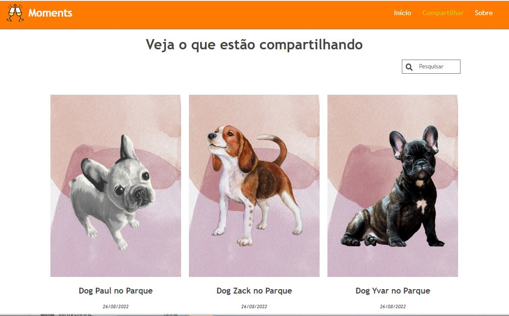
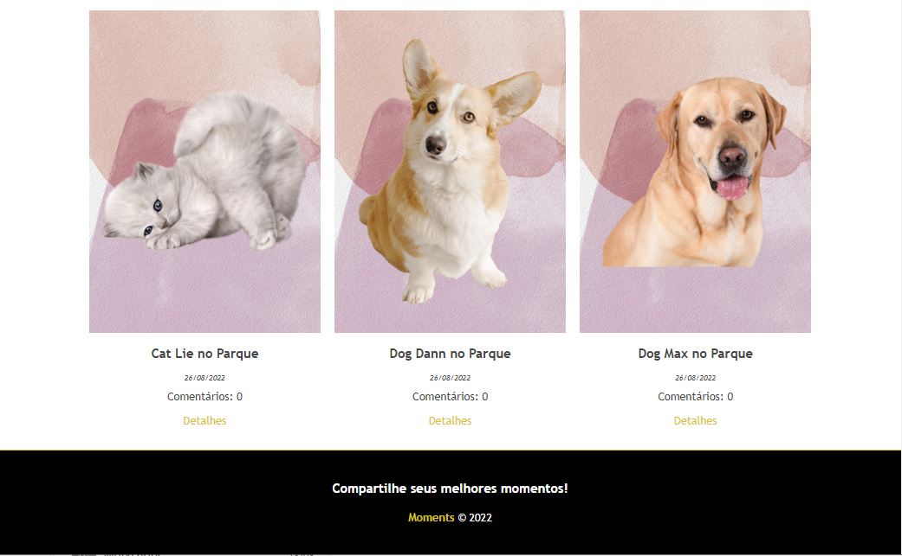
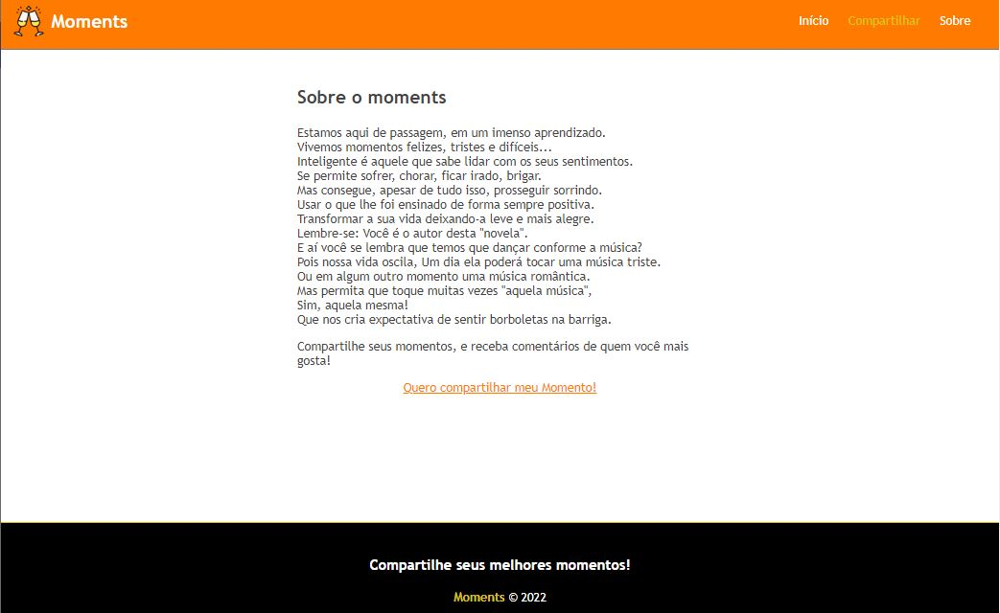
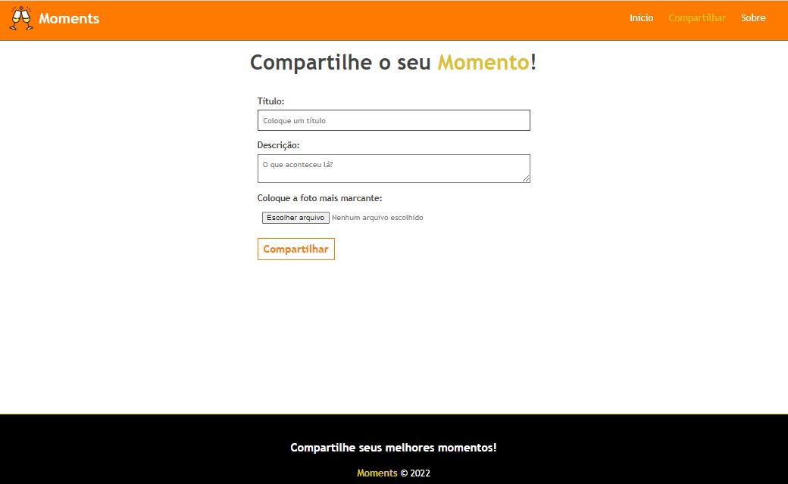
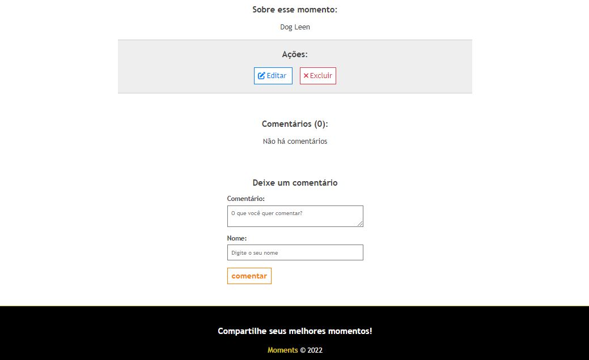
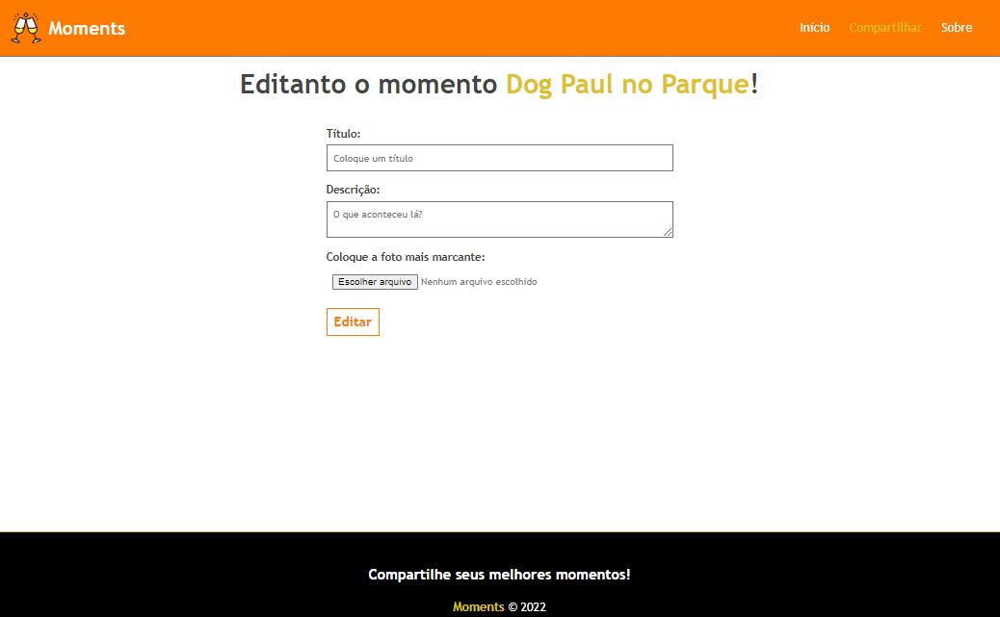

# Projeto Angular 📋

Projeto desenvolvido através do consumo de uma API para uma página de registro de acontecimentos.
Tecnologias utilizadas: Node e Angular

-----------------------------------------------------------------
# Angular 📋

Angular é uma plataforma de aplicações web de código-fonte aberto e front-end baseado em TypeScript liderado pela Equipe Angular do Google e por uma comunidade de indivíduos e corporações.

-----------------------------------------------------------------
# Node 📋

Node.js é um software de código aberto, multiplataforma, baseado no interpretador V8 do Google e que permite a execução de códigos JavaScript fora de um navegador web.

-----------------------------------------------------------------

## ↘️ Cadastro de Momentos

  

  
-----------------------------------------------------------------

## 🔀 Sobre

  

-----------------------------------------------------------------

## ✅ Formulário de Cadastro

  

-----------------------------------------------------------------

## ✅ Detalhes 

  

-----------------------------------------------------------------

## ✅ Página de Edição

  

-----------------------------------------------------------------

